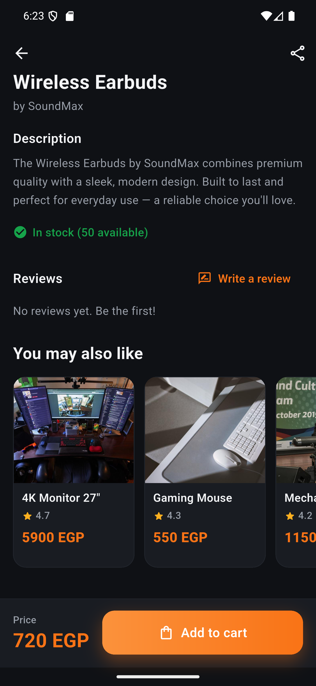
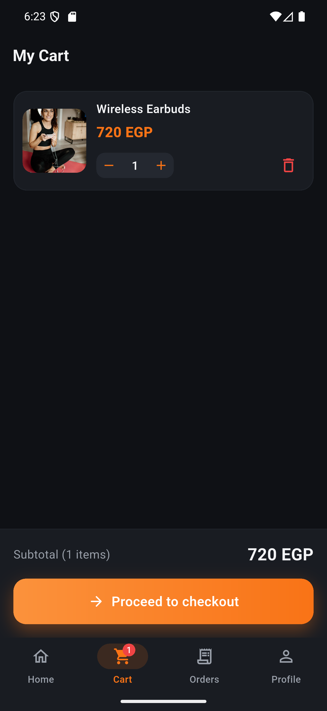
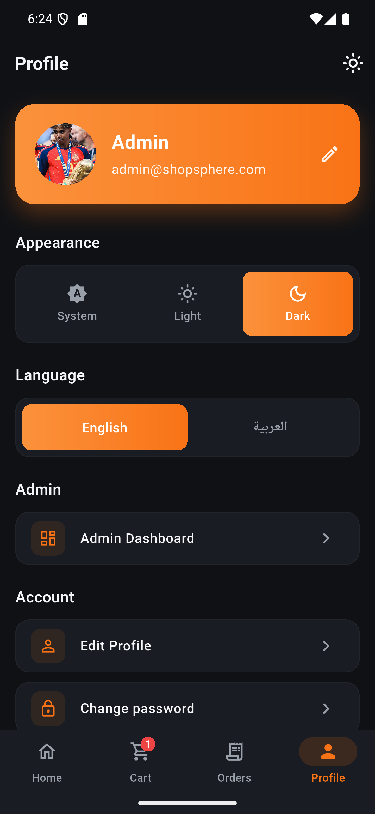
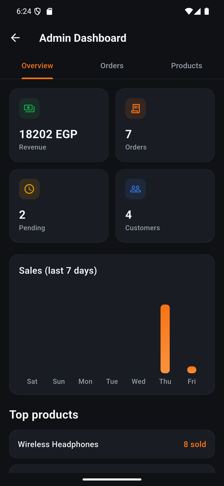
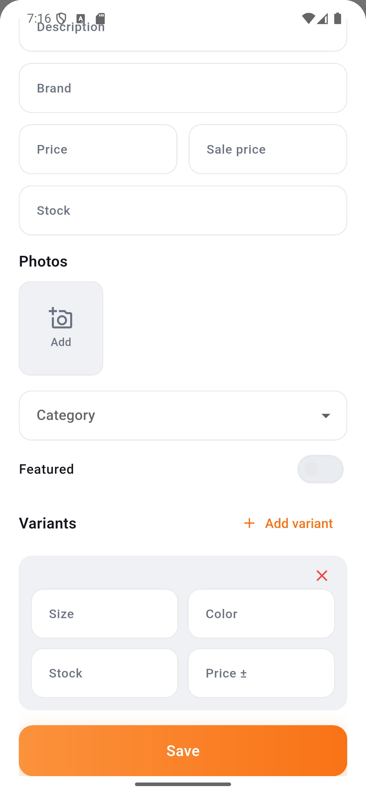

# ShopSphere — Full-Stack E-Commerce App

A complete shopping application built with a **Flutter** mobile client and a
**Laravel 10 REST API**. It covers the full commerce flow — browsing, search,
cart, checkout, orders — plus a built-in **admin panel** for managing products,
categories, coupons, and orders.

- **Frontend:** Flutter (Dart) · BLoC/Cubit · clean feature-first architecture
- **Backend:** Laravel 10 · Sanctum token auth · MySQL
- **Languages:** English + Arabic (RTL) · Light + Dark themes

---

## Screenshots

<table>
  <tr>
    <td align="center"><br><sub>Home</sub></td>
    <td align="center"><br><sub>Product details</sub></td>
    <td align="center"><br><sub>You may also like</sub></td>
  </tr>
  <tr>
    <td align="center"><br><sub>Cart</sub></td>
    <td align="center"><br><sub>Profile</sub></td>
    <td align="center"><br><sub>Admin dashboard</sub></td>
  </tr>
  <tr>
    <td align="center"><br><sub>Home (light theme)</sub></td>
    <td align="center"><br><sub>Admin — photos &amp; variants</sub></td>
    <td></td>
  </tr>
</table>

---

## Features

### Customer
- **Auth** — register, login, forgot/reset password, change password (Sanctum tokens)
- **Home** — banners, categories, "Recommended for you", popular products with infinite scroll
- **Search & filters** — debounced search, recent searches, price range, sort (newest / price / rating)
- **Product details** — image gallery, **variants (size / colour)** with live price, stock status, reviews & ratings, "You may also like"
- **Wishlist** — favourite products, synced across the app
- **Cart** — add variants, update quantity, stock-aware
- **Checkout** — saved addresses, cash on delivery / card, coupon codes, order summary
- **Orders** — history, order details, status timeline, cancel, reorder
- **Profile** — avatar upload, edit profile, change password, theme & language switch

### Admin
- **Dashboard** — revenue, orders, pending, customers, 7-day sales chart, top products
- **Products** — full CRUD with **multiple image upload** and **variant management**
- **Categories** — create / update / delete
- **Coupons** — percentage or fixed, min-total and expiry rules
- **Orders** — view all, update status (stock is returned automatically on cancel)

---

## Tech Stack

| Layer | Tools |
|-------|-------|
| State management | `flutter_bloc` (Cubit), `equatable` |
| Networking | `dio`, `pretty_dio_logger` |
| DI | `get_it` (service locator) |
| Error handling | `dartz` (`Either<Failure, T>`) |
| UI | `flutter_screenutil`, `cached_network_image`, `shimmer`, `fl_chart` |
| Media | `image_picker`, `share_plus` |
| Localization | `easy_localization` (ar / en) |
| Storage | `shared_preferences` |
| Backend | Laravel 10, Sanctum, Eloquent, MySQL |

---

## Project Structure

```
ecommerce_app/
├── lib/                      # Flutter app
│   ├── core/                 # theme, network (Dio + service locator), widgets, utils
│   └── features/             # feature-first modules
│       ├── auth/  home/  cart/  checkout/  order/
│       ├── address/  wishlist/  settings/  admin/
│       └── onboarding/  splash/
│           └── <feature>/
│               ├── data/          (models, repo, repo_impl)
│               └── presentation/  (view, view_model/cubit)
├── assets/translations/      # en.json, ar.json
└── backend/                  # Laravel API
    ├── app/Http/Controllers  # Auth, Product, Cart, Order, Coupon, Admin…
    ├── app/Models
    ├── database/migrations
    └── routes/api.php
```

Each feature follows the same layering: **model → repo (abstract) → repo_impl
(Dio) → cubit → view**, with failures modelled as `Either<Failure, T>`.

---

## Getting Started

### 1. Backend (Laravel API)

```bash
cd backend
composer install
cp .env.example .env
php artisan key:generate

# configure your database (MySQL) in .env, then:
php artisan migrate --seed
php artisan storage:link          # required so uploaded images are served
php artisan serve                 # http://127.0.0.1:8000
```

> **Note:** `storage:link` must point at *this* project. If the repo was copied
> from another folder, delete `backend/public/storage` and re-run the command.

**Seeded demo accounts:**

| Role | Email | Password |
|------|-------|----------|
| Admin | `admin@shopsphere.com` | `admin123` |
| Customer | `customer@shopsphere.com` | `password` |

### 2. Frontend (Flutter)

```bash
flutter pub get
```

Set the API base URL in [`lib/core/network/api_service.dart`](lib/core/network/api_service.dart)
to match how you run the server:

| Target | Base URL |
|--------|----------|
| Android emulator | `http://10.0.2.2:8000/api/` |
| iOS simulator / desktop | `http://127.0.0.1:8000/api/` |
| Physical device | `http://<your-computer-LAN-IP>:8000/api/` |

Then run:

```bash
flutter run
```

---

## API Overview

Base path: `/api` · Auth: `Authorization: Bearer <token>` (Sanctum)

**Public**
```
POST /register            POST /login
POST /password/forgot     POST /password/reset
GET  /categories          GET  /categories/{id}
GET  /products            GET  /products/{id}
GET  /products/{id}/related    GET /products/{id}/reviews
```

**Authenticated**
```
GET  /me                  POST /logout        POST /profile
GET/POST/PUT/DELETE /cart      POST /coupons/apply
GET/POST/PATCH /orders         apiResource /addresses
POST /products/{id}/reviews    POST /wishlist/{id}
```

**Admin** (`/admin`, requires admin role)
```
Products, Categories, Coupons CRUD
GET  /admin/orders     PATCH /admin/orders/{id}/status
GET  /admin/stats
```

---

## Localization & Theming

- Strings live in [`assets/translations/en.json`](assets/translations/en.json) and `ar.json`.
- Arabic switches the app to RTL automatically.
- Theme (System / Light / Dark) and language are toggled from the Profile screen.

---

## License

This project is provided for educational and portfolio use.
